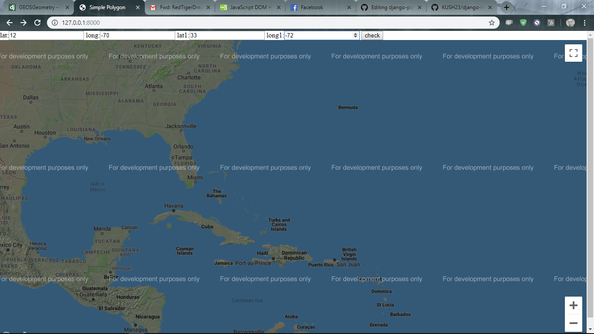
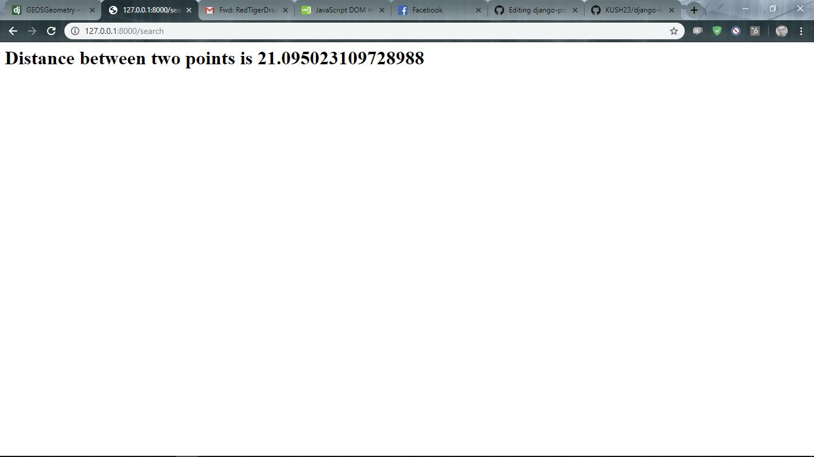

# Linear Distance 

## Installation Procedure:

* pip install django

* pip install GDAL == 3.00

* run "python manage.py runserver"

* open http://127.0.0.1:8000/ in browser

## Troubleshoot:
* check your GDAL version in {Python root}\Lib\site-packages\osgeo in my case C:\Python37\Lib\site-packages\osgeo
 
* add your version of gdal in line 26 in C:\Python37\Lib\site-packages\django\contrib\gis\gdal/libgdal.py

## Project Description:
  Project completed using linear shortest distance between two points. Points are hard coded inside the "index.html" which can be twaek manually. A deprecated google API version make it little difficult to be more interactive.

## Caveats:
 * The sample points are hard coded, could become more intercative with better google Map API's.
 
 * Also, the algorithm is to improve optimally.
